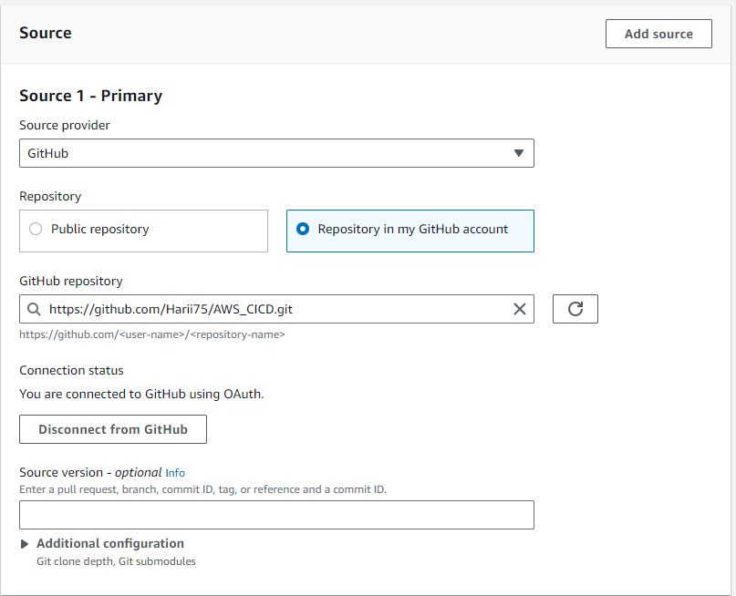
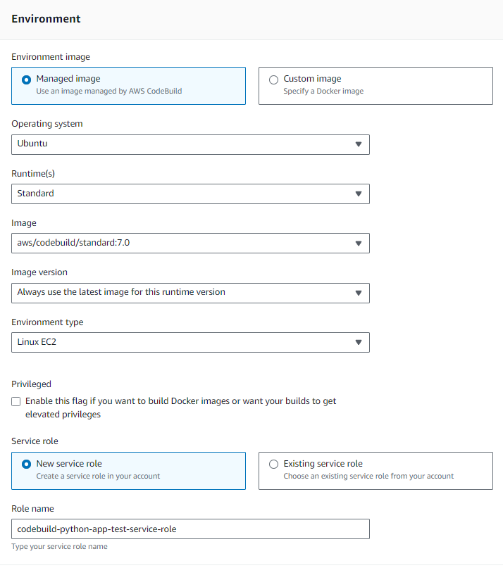

# AWS CICD PIPELINE

- A projektnek csak a CI része van ledokumentálva
!

## Projekt célja:
Ebben a projektben egy egyszerű Flask alkalmazást implementálunk egy CI/CD pipeline-ba. Az alkalmazás kódját a CodeCommit használatával kezeljük, a CodeBuild segítségével építjük, a CodePipeline segítségével automatizáljuk a CI/CD folyamatot,CodeDeploy használatával telepítjük az alkalmazást egy EC2 VM-re.

## Lépések:
### 1. CodeCommit beállítása.

  Előszőr létrehozzuk a projektet.  
   
  
  Ezt követően összekötjük a GitHub fiókunkat az CodeCommittal és kiválasztjuk a repot ahol a Flask appunk van. 
   

  Ezen a projeken Ubuntu fut  
   

  Majd a CodeCommithoz rendelt role-hoz hozzáadjuk a  "SSMFullAccess"-t policyt, hogy önállóan működni.
