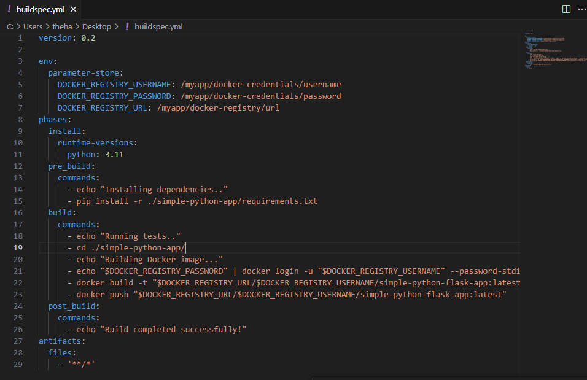
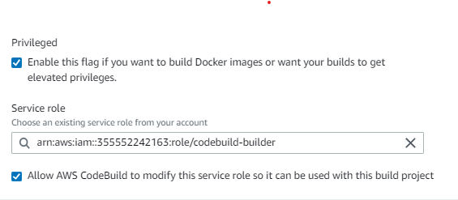
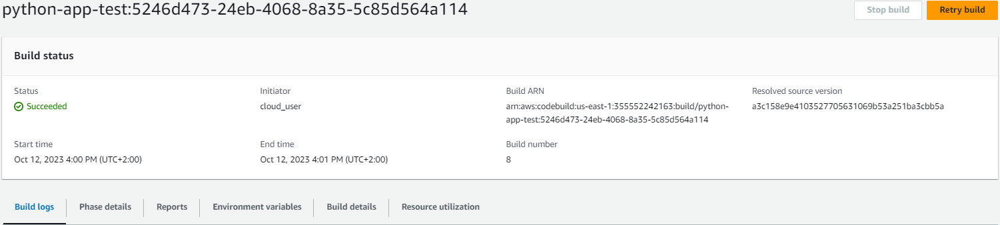
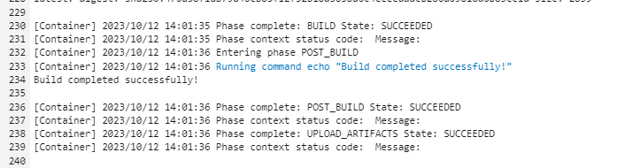
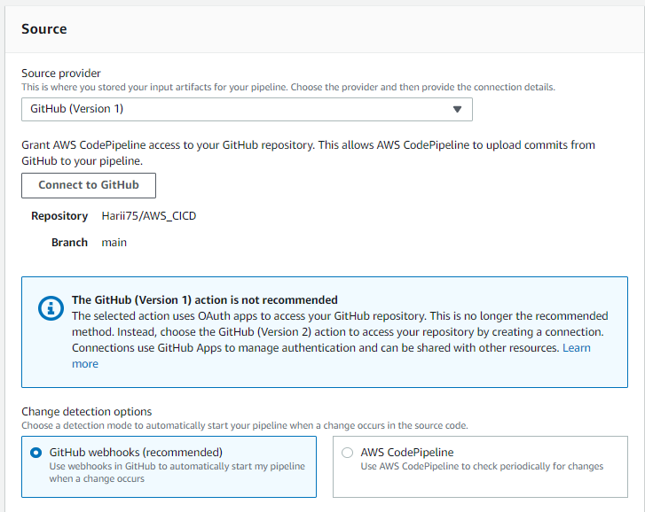
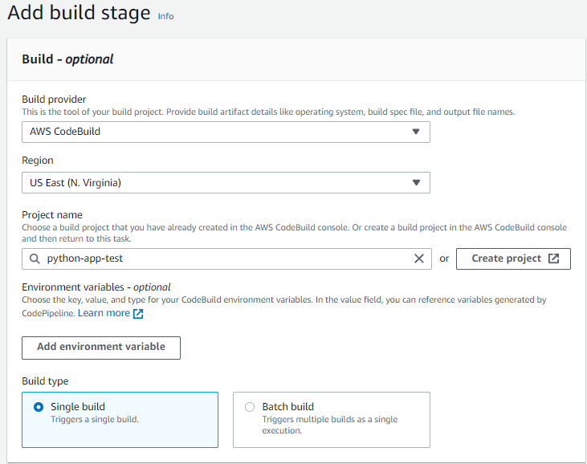

# AWS CICD PIPELINE

- A projektnek csak a CI része van ledokumentálva.
  

## Projekt célja:
Ebben a projektben egy egyszerű Flask alkalmazást implementálunk egy CI/CD pipeline-ba. Az alkalmazás kódját a CodeCommit használatával kezeljük, a CodeBuild segítségével építjük, a CodePipeline segítségével automatizáljuk a CI/CD folyamatot,CodeDeploy használatával telepítjük az alkalmazást egy EC2 VM-re.

## Lépések:
### 1. CodeBuild configurálása.

  Előszőr létrehozzuk a projektet.  
  
   
  

  
  Ezt követően összekötjük a GitHub fiókunkat az CodeBuilddel és kiválasztjuk a repot ahol a Flask appunk van. 

  
   
  

  
  Erre a projekrre Ubuntut választottam.  
  
   

  Majd a CodeCommithoz rendelt role-hoz hozzáadjuk a  "SSMFullAccess"-t policyt, hogy önállóan működni és mivel ez csak egy projektes AWS fiók volt ezért full S3 acesst kapott, ugyanis késöbb a buildeknél dolgozni fog a tárhellyel is.

  

  
  A build specsnél megadjuk szükséges stageket és secreteket.
  - Env: Itt megadásra kerültek a "bizalmas" adatok a SystemsManager \ ParameterStore serviceben ahol Key/Value párok segítségével biztonságosabban tudok buildelni.
  - Install: Egy teljessen alap szál Flask appot fogunk hostolni. A Flash egy Python web framework tehát tel kell telepítünk a Python legutolsó verzióját.
  - PreBuild: Dependency telepítések: Flask.
  - Build: Ez a rész Docker segítségével fog megtörténni, utána a Docker Registry-re (docker.io) fogja felpusholni az imaget a célrepóba.
  - PostBuild: Sima clearup, jelzi, hogy átjutott az előző három fázison. 

   
  

  Ezek után természetesen nem felejtünk el jogot is adni az image buildeléshez. 
  
   
  

  Valamint a sikeres buildek ahol láthatjuk a cleanup messaget:
  
   
   
  

  
  ### 2. CodePipeline configurálása.

  Ezért kellet az S3 acess, ugyanis ez egy temporary AWS fiók, és restrictelve van a GitHub v2-re. Ez csak annyit jelenet, hogy le kell töltenie a repot build előtt. 
  
   

  

  Az előző képen látott újboli fiókösszekötés és a webhook alapú change detection kiválasztása után meghatározzuk a build staget. 

   

  

  És végül kész van a CI része a projektnek.  
  
   

  

  

  

